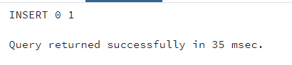
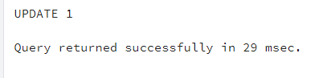
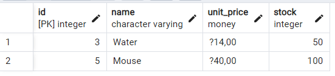

# 22.11.2022 SQL ÖDEV

## * Hangi Kategoride kaç ürün vardır(Inner Join)
`select ca.name, count(pr.id) as adet from products pr
inner join product_categories pc
on pr.id = pc.product_id
inner join categories ca
on ca.id=pc.category_id
group by ca.name
order by adet desc`

  

## * --product tablosuna ürün eklemek
`INSERT INTO products(name,stock,unit_price)
VALUES('masa',5,200)`

  

## * --isme göre masa isimli ürün stok durumunu update edildi

`UPDATE products
SET stock=30
WHERE products."name"='masa'`

  

  
## * --outer join

`SELECT * from product_categories pc
full outer join products p 
on pc.product_id= p.id`

  

  
## * B-- Ankara'dan sipariş veren müşterilerin müşteri numarası?

`select ci.name, cu.customer_no from cities ci
inner join addresses addr on ci.id = addr.id
inner join customers cu on addr.id = cu.id
inner join orders o on cu.id = o.id
where ci.name = 'Ankara' 
order by cu.customer_no`

  

  
## *--Between

`SELECT *
FROM products
 Where stock Between 0 and 150`

  

