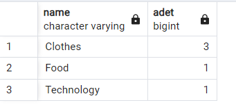

# 22.11.2022 SQL ÖDEV

## * Hangi Kategoride kaç ürün vardır(Inner Join)
`select ca.name, count(pr.id) as adet from products pr
inner join product_categories pc
on pr.id = pc.product_id
inner join categories ca
on ca.id=pc.category_id
group by ca.name
order by adet desc`

  

## * --product tablosuna ürün eklemek
`INSERT INTO products(name,stock,unit_price)
VALUES('masa',5,200)`

## * --isme göre masa isimli ürün stok durumunu update edildi

`UPDATE products
SET stock=30
WHERE products."name"='masa'`

  
## * --outer join

`SELECT * from product_categories pc
full outer join products p 
on pc.product_id= p.id`

  

  
## * Bütün kullanıcılar ve siparişler (RIGHT JOIN)
`Select * from orders
right join customer on orders.customer_id = customer.id`

  

  
## * Renklerin ve ürünlerin hepsini (FULL OUTER JOIN)
`Select color.name as "Renk", product.name "Ürün" from product
full outer join color on product.color_id = color.id
order by product.name`

  

